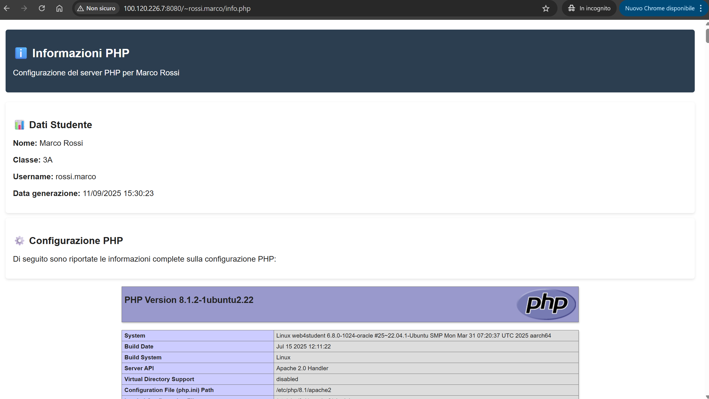
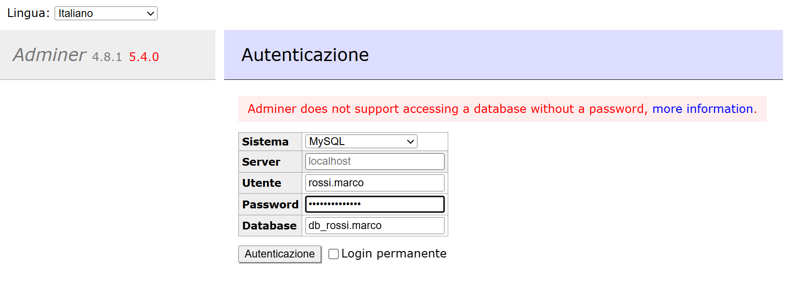
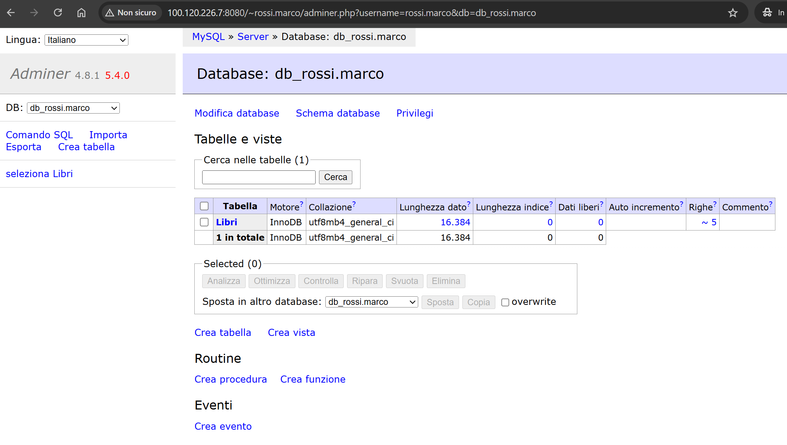
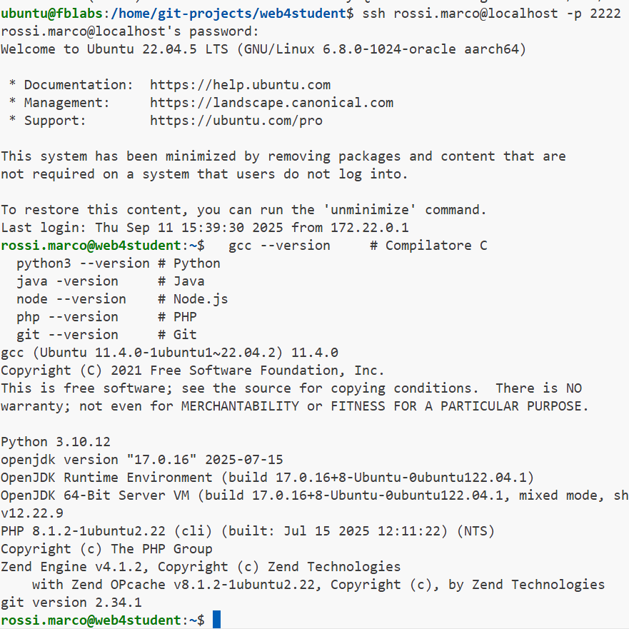

# 🌟 Web4Student - Ambiente di Sviluppo Educativo

**Un container Docker completo per l'insegnamento della programmazione e dello sviluppo web**

[](https://www.docker.com/)
[](https://ubuntu.com/)
[](LICENSE)

---

## 📖 Cos'è Web4Student?

Web4Student è un **ambiente di sviluppo educativo completo** basato su Docker che fornisce tutto il necessario per insegnare e imparare:

- 🖥️ **Programmazione**: C/C++, Python, Java, JavaScript, PHP
- 🌐 **Sviluppo Web**: Apache, PHP, MySQL con interfaccia Adminer, Node.js
- 🔧 **Strumenti DevOps**: Git, SSH, Docker, container orchestration
- 👥 **Gestione Utenti**: Account individuali con isolamento completo
- 📊 **Database**: MySQL/MariaDB con database personali per studente
- 🔒 **Sicurezza**: Permessi isolati e protezione dei dati

Perfetto per **scuole, università e corsi di programmazione**!

🌐 **Guarda il sito online:** [w4s.filippobilardo.it](https://w4s.filippobilardo.it)

---

## 🎯 Caratteristiche Principali

### 🏗️ Architettura
- ✅ **Containerizzato**: Ambiente isolato e riproducibile
- ✅ **Persistente**: Dati studenti salvati su volumi Docker
- ✅ **Scalabile**: Supporto multi-utente con risorse dedicate
- ✅ **Sicuro**: Isolamento completo tra utenti e dati protetti

### 💻 Ambiente di Sviluppo
- ✅ **Linguaggi**: C/C++, Python 3, Java 17, JavaScript/Node.js, PHP 8.1
- ✅ **Framework**: Express.js, Maven, Gradle, Composer
- ✅ **Database**: MySQL 8.0 con Adminer (interfaccia web)
- ✅ **Strumenti**: Git, SSH, Vim, Nano, Make, CMake

### 🌐 Stack Web Completo
- ✅ **Web Server**: Apache 2.4 con mod_rewrite e SSL
- ✅ **Database**: MySQL/MariaDB con connessione sicura
- ✅ **Adminer**: Interfaccia web per gestione database
- ✅ **UserDir**: Siti web personali per ogni studente

### 👥 Gestione Studenti
- ✅ **Account Automatici**: Creazione da file CSV
- ✅ **Home Isolate**: Directory personali protette
- ✅ **Database Personali**: Schema dedicato per studente
- ✅ **Quote Disco**: nuovi studenti 8 MB soft/10 MB hard; amministratori 50 MB soft/100 MB hard. L'applicazione richiede che il filesystem host montato su `/home` sia abilitato alle quote utente (`usrquota`); in caso contrario gli script mostrano un avviso
- ✅ **Quota Processi**: Gli account del gruppo `web4students` sono limitati a 100 processi per utente
- ✅ **SSH Access**: Connessione sicura per ogni studente

---

## � Screenshots

### 🏠 Homepage Principale

*Interfaccia web principale con navigazione e strumenti disponibili*

### 👨‍🎓 Area Studente

*Spazio personale dello studente con progetti e risorse*

### 🗄️ Gestione Database

*Interfaccia Adminer per la gestione dei database MySQL*

### ⚙️ Pannello di Controllo

*Dashboard amministrativa per monitoraggio e gestione*

---

## �🚀 Quick Start (5 minuti)

### 1. Clona e Posizionati
```bash
git clone https://github.com/filippo-bilardo/web4student.git
cd web4student
```

### 2. Avvia il Container
```bash
# Avvio semplice
./manage.sh start

# Oppure con Docker Compose
docker compose up -d
```

Il bootstrap avvia i servizi, prepara gli account amministrativi e ripristina
automaticamente gli account studenti dalle home persistenti. La gestione
manuale resta disponibile con `create-users`, `create-users-file` e
`restore-users`.

I file del sito principale sono persistenti in `volumes/www`, montati come
DocumentRoot Apache. Per aggiornare la homepage basta modificare
`volumes/www/index.html`; non è necessario ricostruire l'immagine.

### 3. Accedi al Sistema
```bash
# SSH come amministratore
ssh prof@localhost -p 2222
# Password: quella definita in .env per ADMIN1

# Oppure via web
open http://localhost:8080
```

### 4. Crea Studenti (Opzionale)
```bash
# Crea utenti da CSV
./manage.sh create-users

# Crea utenti da un CSV alternativo
./manage.sh create-users-file volumes/students/2026_5Fi.csv

# Se il container è stato ricreato, ripristina gli account dalle home persistenti
./manage.sh restore-users

# Riepilogo spazio occupato dalle home degli studenti
./manage.sh student-usage

# Studenti loggati e utilizzo CPU/RAM
./manage.sh system-usage

# Verifica stato
./manage.sh status
```

**🎉 Il tuo ambiente educativo è pronto!**

> 📋 **Prima volta?** Segui la **[Checklist Operativa](README_checklist.md)** per una guida passo-passo completa!

---

## 📋 Requisiti di Sistema

| Componente | Versione | Note |
|------------|----------|------|
| **Docker** | ≥ 20.10 | Engine + Compose |
| **Docker Compose** | ≥ 2.0 | Plugin integrato |
| **RAM** | ≥ 2GB | 4GB raccomandati |
| **Disco** | ≥ 10GB | Per dati studenti |
| **OS** | Linux/macOS/Windows | Con Docker Desktop |

---

## 🔧 Configurazione Dettagliata

### File di Configurazione
```
web4student/
├── Dockerfile              # Build del container
├── docker-compose.yml      # Orchestrazione servizi
├── manage.sh              # Script di gestione
├── students.csv           # Lista studenti (opzionale)
└── volumes/               # Dati persistenti
    ├── config/           # Configurazioni web
    ├── home/             # Directory studenti
    ├── students/         # CSV aggiuntivi
    ├── mysql_data/       # Database MySQL
    └── logs/             # Log di sistema
```

### Variabili d'Ambiente
```yaml
# docker-compose.yml
environment:
  - MYSQL_ROOT_PASSWORD=${MYSQL_ROOT_PASSWORD}
  - MYSQL_ADMIN_USER=${MYSQL_ADMIN_USER}
  - MYSQL_ADMIN_PASSWORD=${MYSQL_ADMIN_PASSWORD}
  - APACHE_RUN_USER=www-data
  - APACHE_RUN_GROUP=www-data
```

Le password non devono essere scritte in `docker-compose.yml` o nel Dockerfile.
Definirle nel file locale `.env`, escluso da Git:

```dotenv
MYSQL_ROOT_PASSWORD=<segreto>
MYSQL_ADMIN_USER=admin
MYSQL_ADMIN_PASSWORD=<segreto>
STUDENT_DEFAULT_PASSWORD=<segreto>
```

### Porte Mappate
| Porta Host | Porta Container | Servizio |
|------------|----------------|----------|
| `8080` | `80` | Apache HTTP |
| `8443` | `443` | Apache HTTPS |
| `2222` | `22` | SSH |
| `3307` | `3306` | MySQL |

---

## 👨‍🎓 Guida per Studenti

### Primo Accesso
```bash
# Connettiti via SSH
ssh username@localhost -p 2222
# Password iniziale: valore di STUDENT_DEFAULT_PASSWORD

# Cambia password
passwd
```

La password cambiata viene salvata in modo persistente e resta valida anche dopo riavvio o ricreazione del container.

Quando il CSV contiene la colonna `anno`, la home viene creata nel formato
`/home/anno/classe/username`, ad esempio `/home/2026/5FINF/crimella.luca`.

### Il Tuo Ambiente Personale
```
🏠 ~/                     # Home directory
├── www/                  # Sito web personale
│   ├── index.html       # Pagina principale
│   ├── style.css        # Fogli di stile
│   └── info.php         # Info PHP
└── README.txt           # Guida personale
```

### Database Personale
```bash
# Accedi al tuo database
mysql -u username -p
# Password: username123
# Database: db_username

# Oppure usa Adminer:
# http://localhost:8080/~username/adminer.php
```

### Sito Web Personale
- **URL**: `http://localhost:8080/~username/`
- **Directory**: `~/www/`
- **Supporto**: HTML, PHP, CSS, JS, immagini, PDF...

---

## 👨‍🏫 Guida per Docenti

### Creazione Studenti
```bash
# 1. Prepara file CSV
cat > students.csv << EOF
anno,classe,cognome,nome,username
2026,3A,Rossi,Marco,rossi.marco
2026,3A,Bianchi,Giulia,bianchi.giulia
EOF

# 2. Crea account
./manage.sh create-users

# 2b. Ripristina gli account presenti nei volumi persistenti
./manage.sh restore-users

# Le password cambiate dagli utenti restano persistenti
# anche dopo restart o recreate del container

# 3. Verifica
./manage.sh status
```

### Gestione Container
```bash
# Script di gestione completo
./manage.sh start        # Avvia
./manage.sh stop         # Ferma
./manage.sh restart      # Riavvia
./manage.sh logs         # Visualizza log
./manage.sh shell        # Accesso shell
./manage.sh create-users-file volumes/students/2026_5Fi.csv # CSV alternativo
./manage.sh restore-users # Ricrea account dalle home persistenti
./manage.sh student-usage # Riepilogo spazio home studenti
./manage.sh system-usage  # Studenti loggati e CPU/RAM
./manage.sh configure-quotas # Applica quote disco amministrative
./manage.sh configure-limits # Applica limite processi studenti
./manage.sh check         # Suite di controlli
./manage.sh backup       # Backup dati
./manage.sh clean        # Reset completo
```

### Monitoraggio
```bash
# Stato container
docker ps

# Log Apache
docker logs web4student

# Utilizzo risorse
docker stats web4student

# Accesso database globale
mysql -h localhost -P 3307 -u admin -p
```

---

## 🔒 Sicurezza e Best Practices

### 🛡️ Misure di Sicurezza Implementate
- ✅ **Isolamento Utenti**: Home directory protette (chmod 755 + rimozione lettura "others")
- ✅ **Database Sicuri**: Credenziali individuali e schemi separati
- ✅ **File CSV Protetti**: chown root:root, chmod 600
- ✅ **SSH Sicuro**: Chiavi SSH supportate, password iniziali da cambiare
- ✅ **Apache Configurato**: Solo file web accessibili pubblicamente

### 📋 Checklist Sicurezza
- [ ] Impostare password robuste nel file `.env`
- [ ] Rimuovere file CSV dopo creazione utenti
- [ ] Configurare firewall se necessario
- [ ] Monitorare log di accesso
- [ ] Backup regolare dei dati

---

## 🐛 Risoluzione Problemi

### Problemi Comuni

#### Container non si avvia
```bash
# Verifica porte libere
netstat -tlnp | grep -E ':(80|443|22|3306)'

# Log dettagliati
./manage.sh logs

# Ricostruzione
./manage.sh build
./manage.sh start
```

#### Accesso SSH fallisce
```bash
# Verifica chiave SSH
ssh-keygen -f "~/.ssh/known_hosts" -R "[localhost]:2222"

# Test connessione
ssh -v prof@localhost -p 2222
```

#### Database non accessibile
```bash
# Verifica servizio MySQL
docker exec web4student service mysql status

# Test connessione
mysql -h localhost -P 3307 -u admin -p
```

#### Sito web non funziona
```bash
# Verifica Apache
docker exec web4student service apache2 status

# Test locale
curl http://localhost:8080
```

### Log e Debug
```bash
# Log completi
docker logs web4student

# Accesso container
docker exec -it web4student bash

# Verifica processi
docker exec web4student ps aux

# Studenti loggati e utilizzo CPU/RAM
./manage.sh system-usage
```

### Limite processi degli studenti

Gli account studenti appartengono al gruppo `web4students`. La configurazione
`volumes/config/web4student-students.conf` imposta un limite soft e hard di 100
processi per account, applicato alle nuove sessioni SSH tramite `pam_limits`.
Questo riduce l'impatto di fork bomb e programmi che generano processi senza
controllo.

---

## 🤝 Contributi

Contributi benvenuti! Per contribuire:

1. 🍴 Fork il progetto
2. 🌿 Crea un branch: `git checkout -b feature/nome-feature`
3. 📝 Commit changes: `git commit -m 'Aggiunta feature'`
4. 🚀 Push: `git push origin feature/nome-feature`
5. 🔄 Pull Request

---

## 📄 Licenza

Questo progetto è distribuito sotto licenza **MIT**. Vedi il file [LICENSE](LICENSE) per dettagli.

---

## 🙋 Supporto

- 📧 **Email**: filippo.bilardo@email.com
- 🐛 **Issues**: [GitHub Issues](https://github.com/filippo-bilardo/web4student/issues)
- 📖 **Wiki**: [Documentazione Completa](https://github.com/filippo-bilardo/web4student/wiki)

---

**🎓 Web4Student - Trasforma il modo di insegnare programmazione!**
